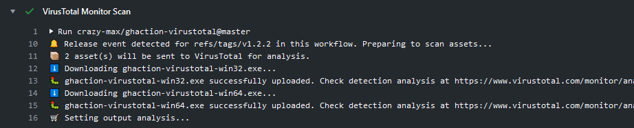

<p align="center"><a href="https://github.com/crazy-max/ghaction-virustotal" target="_blank"></a></p>

<p align="center">
  <a href="https://github.com/crazy-max/ghaction-virustotal/releases/latest"></a>
  <a href="https://github.com/marketplace/actions/virustotal-github-action"></a>
  <a href="https://github.com/crazy-max/ghaction-virustotal/actions?workflow=ci"></a>
  <a href="https://github.com/crazy-max/ghaction-virustotal/actions?workflow=test"></a>
  <a href="https://codecov.io/gh/crazy-max/ghaction-virustotal"></a>
  <br /><a href="https://github.com/sponsors/crazy-max"></a>
  <a href="https://www.paypal.me/crazyws"></a>
</p>

## About

GitHub Action to upload and scan files with [VirusTotal](https://www.virustotal.com).

If you are interested, [check out](https://git.io/Je09Y) my other :octocat: GitHub Actions!

___

* [Usage](#usage)
  * [Scan local files](#scan-local-files)
  * [Scan assets of a published release](#scan-assets-of-a-published-release)
  * [Scan through VirusTotal Monitor](#scan-through-virustotal-monitor)
* [Customizing](#customizing)
  * [inputs](#inputs)
  * [outputs](#outputs)
* [How can I help?](#how-can-i-help)
* [License](#license)

## Usage

### Scan local files

This action can be used to scan local files with VirusTotal:


```yaml
name: build

on:
  pull_request:
  push:

jobs:
  build:
    runs-on: ubuntu-latest
    steps:
      -
        name: Checkout
        uses: actions/checkout@v2
      -
        name: Set up Go
        uses: actions/setup-go@v2
      -
        name: Build
        run: |
          GOOS=windows GOARCH=386 go build -o ./ghaction-virustotal-win32.exe -v -ldflags "-s -w"
          GOOS=windows GOARCH=amd64 go build -o ./ghaction-virustotal-win64.exe -v -ldflags "-s -w"
      -
        name: VirusTotal Scan
        uses: crazy-max/ghaction-virustotal@v2
        with:
          vt_api_key: ${{ secrets.VT_API_KEY }}
          files: |
            ./ghaction-virustotal-win32.exe
            ./ghaction-virustotal-win64.exe
```

### Scan assets of a published release

You can also use this action to scan assets of a published release on GitHub when a [release event](https://help.github.com/en/actions/reference/events-that-trigger-workflows#release-event-release) is triggered:


```yaml
name: released

on:
  release:
    types: [published]

jobs:
  virustotal:
    runs-on: ubuntu-latest
    steps:
      -
        name: VirusTotal Scan
        uses: crazy-max/ghaction-virustotal@v2
        with:
          vt_api_key: ${{ secrets.VT_API_KEY }}
          github_token: ${{ secrets.GITHUB_TOKEN }}
          files: |
            *.exe
```

If you set `update_release_body: true` input, analysis link(s) will be appended to the release body and will look like this:


### Scan through VirusTotal Monitor

To scan your assets through VirusTotal Monitor you can use the following workflow:



```yaml
name: build

on:
  pull_request:
  push:

jobs:
  build:
    runs-on: ubuntu-latest
    steps:
      -
        name: Checkout
        uses: actions/checkout@v2
      -
        name: Set up Go
        uses: actions/setup-go@v2
      -
        name: Build
        run: |
          GOOS=windows GOARCH=386 go build -o ./ghaction-virustotal-win32.exe -v -ldflags "-s -w"
          GOOS=windows GOARCH=amd64 go build -o ./ghaction-virustotal-win64.exe -v -ldflags "-s -w"
      -
        name: VirusTotal Monitor Scan
        uses: crazy-max/ghaction-virustotal@v2
        with:
          vt_api_key: ${{ secrets.VT_API_KEY }}
          vt_monitor: true
          monitor_path: /ghaction-virustotal
          files: |
            ./ghaction-virustotal-*.exe
```

## Customizing

### inputs

Following inputs can be used as `step.with` keys

| Name                        | Type    | Default   | Description                      |
|-----------------------------|---------|-----------|----------------------------------|
| `vt_api_key`                | String  |           | [VirusTotal API key](https://developers.virustotal.com/v3.0/reference#authentication) to upload assets (**required**) |
| `files`                     | String  |           | Newline-delimited list of path globs/patterns for asset files to upload for analysis (**required**) |
| `vt_monitor`                | Bool    | `false`   | If enabled, files will be uploaded to [VirusTotal Monitor](https://developers.virustotal.com/v3.0/reference#monitor) endpoint |
| `monitor_path`**³**         | String  | `/`       | A path relative to current monitor user root folder to upload files |
| `update_release_body`**¹**  | Bool    | `false`   | If enabled, analysis link(s) will be appended to the release body |
| `github_token`**²**         | String  |           | [GitHub Token](https://help.github.com/en/actions/configuring-and-managing-workflows/authenticating-with-the-github_token) used to create an authenticated client for GitHub API as provided by `secrets` |

> * **¹** Only available if [release event is triggered](#scan-assets-of-a-published-release) in your workflow.
> * **²** Required if [release event is triggered](#scan-assets-of-a-published-release) in your workflow.
> * **³** Only available if `vt_monitor` is enabled.

### outputs

Following outputs are available

| Name          | Type    | Description                           |
|---------------|---------|---------------------------------------|
| `analysis`    | String  | Analysis results formatted as `<filename>=<analysisURL>` (comma separated) |

## How can I help?

All kinds of contributions are welcome :raised_hands:! The most basic way to show your support is to star :star2: the project, or to raise issues :speech_balloon: You can also support this project by [**becoming a sponsor on GitHub**](https://github.com/sponsors/crazy-max) :clap: or by making a [Paypal donation](https://www.paypal.me/crazyws) to ensure this journey continues indefinitely! :rocket:

Thanks again for your support, it is much appreciated! :pray:

## License

MIT. See `LICENSE` for more details.
